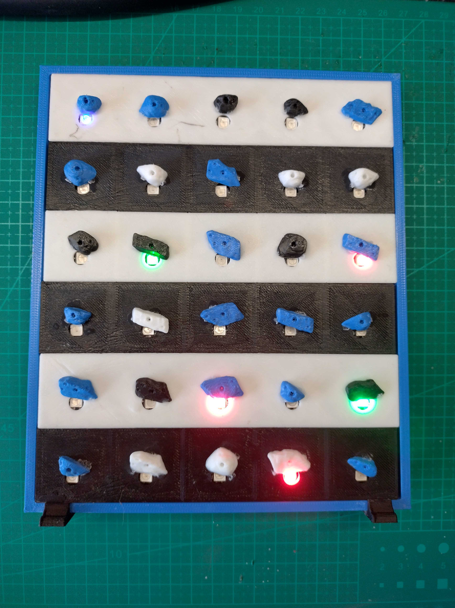

# ESP32 Web Bluetooth LED Grid Controller

A proof-of-concept wireless LED grid controller designed as the foundation for a Moonboard-style home bouldering training system. Uses Web Bluetooth API to connect ESP32 and control 30-LED WS2811 addressable strip in a 5×6 grid pattern. Features multi-page responsive web interface with LED control, test modes, disco patterns, and brightness adjustment. Provides an affordable DIY alternative to commercial climbing training systems.

## Project Structure

```
EspController/
├── index.html              # Main LED controller interface
├── about.html              # Project overview and Moonboard context
├── setup.html              # Installation and troubleshooting guide
├── nav.js                  # Shared navigation component
├── style.css               # Responsive styling with navigation system
├── script.js               # Web Bluetooth API and LED control logic
├── README.md               # This file
├── CLAUDE.md               # Development memory and instructions
├── screenshots/            # Hardware and interface images
│   ├── web-interface.png   # Web interface screenshot
│   ├── hardware-front.png  # LED grid front view
│   └── hardware-back.png   # ESP32 wiring back view
└── board_led_grid/
    └── board_led_grid.ino  # ESP32 Arduino code for WS2811 LED control
```

## Features

### Core LED Control
- **Interactive Grid Interface** - Click-to-control 5×6 LED grid with real-time updates
- **Color Selection** - Cycle through Off, Red, Green, and Blue states
- **Brightness Control** - Adjustable intensity from 5% to 100% via web slider
- **Custom LED Mapping** - Configurable addressing pattern for different layouts

### Test & Pattern Modes
- **Sequential Test Mode** - Automatically test each LED in sequence with 1-second intervals
- **Disco Mode** - Random 5-LED color patterns changing every 2 seconds
- **UI Synchronization** - Visual feedback in web interface during automated modes
- **Manual Configuration** - Send custom LED patterns via JSON commands

### Web Interface
- **Multi-page Navigation** - Responsive website with About and Setup pages
- **Mobile-Friendly Design** - Touch-optimized interface with hamburger navigation
- **Offline Operation** - No server required for core LED control functionality
- **Real-time Status** - Visual connection indicators and command feedback

### Connectivity
- **Web Bluetooth API** - Direct browser-to-ESP32 communication
- **Device Pairing** - Scan and connect to ESP32 without mobile apps
- **Auto-reconnection** - ESP32 restarts advertising after disconnect
- **JSON Protocol** - Structured command format for LED and brightness control

### Moonboard Vision
- **Climbing Training POC** - Foundation for affordable home bouldering systems
- **Scalable Architecture** - Expandable from 5×6 to full Moonboard dimensions
- **Cost-Effective Design** - DIY alternative to $3,000+ commercial systems

## Screenshots

### Web Interface

*Interactive LED grid controller showing the 5x6 grid pattern with color selection and connection status*

### Hardware Setup

*Front view of the LED grid showing the 5x6 arrangement of WS2811 LEDs*


*Back view showing ESP32 connections and wiring to the LED strip*

## Moonboard Training Vision

### What is a Moonboard?
A Moonboard is a standardized climbing training board used worldwide, featuring a grid of climbing holds with LED indicators that light up to show specific boulder problems (routes). This allows climbers to train consistently using the same problems regardless of location.

### DIY Home Training System
This project serves as a proof-of-concept for creating an affordable home version of these commercial systems. While commercial LED climbing boards cost $3,000+, this DIY approach uses readily available components:

- **Current Scale**: 5×6 grid (30 LEDs) for concept demonstration
- **Target Scale**: 11×18 grid (198 holds) matching standard Moonboard dimensions
- **Alternative Scales**: 12×12 Kilter Board style or custom home wall configurations

### Future Roadmap
The modular design enables expansion toward full climbing training features:
- Route database integration with difficulty ratings
- Timer and session tracking for training programs
- Progressive training routines and technique practice
- Community route sharing and standardized problems
- Competition mode with official boulder problems

## Quick Start

### 1. Choose Your Interface
- **🏠 Main Controller**: `index.html` - Interactive LED grid control
- **📖 Project Info**: `about.html` - Moonboard context and vision
- **🔧 Setup Guide**: `setup.html` - Complete installation instructions

### 2. Local Server Setup
Web Bluetooth requires HTTPS or localhost:
```bash
# Navigate to project directory
cd /path/to/EspController

# Start Python server
python -m http.server 8000

# Access at http://localhost:8000
```

### 3. Hardware Setup
1. Upload Arduino code to ESP32
2. Connect WS2811 LED strip to GPIO 4
3. Use external 5V power supply for LEDs
4. Detailed wiring guide available in [Setup page](setup.html)

### 4. Connect and Control
1. Open main interface at `http://localhost:8000`
2. Click "Connect to ESP32" and select device
3. Use grid interface for manual control
4. Try "Test LEDs" for sequential testing
5. Try "Disco Mode" for pattern demonstration

## Requirements

### Web UI
- **Browser**: Chrome or Edge (Web Bluetooth API support required)
- **Connection**: HTTPS or localhost (Web Bluetooth security requirement)
- **Platform**: Windows, macOS, Linux, Android, iOS (in supported browsers)

### ESP32
- **Board**: ESP32 development board (any variant)
- **Arduino IDE**: Version 1.8.x or 2.x
- **Libraries**:
  - ESP32 BLE Arduino library (included with ESP32 board package)
  - FastLED library (for WS2811 LED control)
  - ArduinoJson library (for command parsing)
- **Hardware**: WS2811 addressable LED strip (30 LEDs)

## Setup Instructions

### 1. ESP32 Setup

1. **Install ESP32 Board Package**:
   - Open Arduino IDE
   - Go to `File > Preferences`
   - Add this URL to "Additional Board Manager URLs":
     ```
     https://raw.githubusercontent.com/espressif/arduino-esp32/gh-pages/package_esp32_index.json
     ```
   - Go to `Tools > Board > Boards Manager`
   - Search for "ESP32" and install the package

2. **Install Required Libraries**:
   - Go to `Tools > Manage Libraries`
   - Install "FastLED" by Daniel Garcia
   - Install "ArduinoJson" by Benoit Blanchon

3. **Upload Code**:
   - Open `board_led_grid/board_led_grid.ino` in Arduino IDE
   - Select your ESP32 board: `Tools > Board > ESP32 Arduino > [Your Board]`
   - Select correct port: `Tools > Port > [Your ESP32 Port]`
   - Click "Upload" button
   - Open Serial Monitor (115200 baud) to see connection status

4. **Verify Operation**:
   - Serial Monitor should show: "[BLE] Device discoverable as 'ESP32-LED-Controller'"
   - LED strip should be initialized (all LEDs off)
   - Check serial output for successful BLE advertising

### 2. Web UI Setup

#### Option A: Local Server (Recommended)
**Why needed**: Web Bluetooth requires HTTPS or localhost. Opening HTML files directly uses `file://` protocol which doesn't work.

1. **Start Local Python Server**:
   ```bash
   # Navigate to the webui directory
   cd /path/to/webui
   
   # Python 3 (most common)
   python -m http.server 8000
   
   # Alternative: Python 2 (if needed)
   python2 -m SimpleHTTPServer 8000
   
   # Windows with py launcher
   py -m http.server 8000
   ```

2. **Access Web Application**:
   - Open browser and go to: `http://localhost:8000`
   - **For mobile testing**: Use your computer's IP address: `http://192.168.1.XXX:8000`

#### Option B: Alternative Local Servers
```bash
# Node.js (if installed)
npx serve . -p 8000

# VS Code Live Server Extension
# Right-click index.html -> "Open with Live Server"
```

#### Option C: Direct File (Limited Functionality)
- Double-click `index.html` (may not work due to HTTPS requirement)
- Use only for initial testing

### 3. Connect and Control

1. **Connect to ESP32**:
   - Click "Connect to ESP32" button
   - Select "ESP32-LED-Controller" from device list
   - Status should change to "Connected"

2. **Control LED Grid**:
   - Click grid squares to cycle colors: Off → Red → Green → Blue
   - Click "Send Configuration" to update physical LED strip
   - Use "Clear All" to reset all LEDs to off
   - Grid follows snake pattern addressing (1-30) for proper LED mapping

## Pin Configuration

### Default Configuration
- **WS2811 LED Strip Pin**: GPIO 4 (configurable)
- **LED Count**: 30 LEDs in 5x6 grid pattern

### Common ESP32 Board Variants

| Board Type | Built-in LED Pin | Notes |
|------------|------------------|-------|
| ESP32 DevKit | GPIO 2 | Most common |
| ESP32-WROOM-32 | GPIO 2 | Standard |
| ESP32-S2 | GPIO 15 | Change LED_PIN in code |
| ESP32-C3 | GPIO 8 | Change LED_PIN in code |
| ESP32-S3 | GPIO 48 | Change LED_PIN in code |

### Custom Pin Configuration
To use a different pin, modify this line in `board_led_grid.ino`:
```cpp
#define WS2811_PIN 4  // Change to your desired pin number
```

### LED Strip Wiring
- **Data Pin**: Connect LED strip data input to GPIO 4
- **Power**: Connect LED strip VCC to 5V external power supply
- **Ground**: Connect LED strip GND to both ESP32 GND and power supply GND
- **Current**: Ensure adequate power supply (30 LEDs × 60mA = ~1.8A max)

## Library Requirements

### ESP32 (Arduino IDE)
**Included with ESP32 board package:**
- `BLEDevice.h` - Core BLE functionality
- `BLEServer.h` - BLE server implementation
- `BLEUtils.h` - BLE utilities
- `BLE2902.h` - BLE descriptor support

**Additional libraries required:**
- `FastLED.h` - WS2811 LED strip control
- `ArduinoJson.h` - JSON command parsing

### Web UI
No additional libraries required - uses native Web APIs:
- Web Bluetooth API (built into Chrome/Edge)
- Standard HTML/CSS/JavaScript

## Debugging and Development

### Local Server Setup for Development

**Problem**: Web Bluetooth only works over HTTPS or localhost. Opening `index.html` directly uses `file://` protocol which fails.

**Solution**: Use a local HTTP server to serve the web application.

#### Quick Setup (Python)
```bash
# Navigate to the webui directory
cd /path/to/your/webui

# Start Python HTTP server (most common method)
python -m http.server 8000

# Alternative commands:
python3 -m http.server 8000     # Explicit Python 3
python2 -m SimpleHTTPServer 8000 # Python 2 (legacy)
py -m http.server 8000           # Windows py launcher
```

#### Access the Application
- **Local testing**: `http://localhost:8000`
- **Mobile testing**: `http://YOUR_COMPUTER_IP:8000` (e.g., `http://192.168.1.100:8000`)
- **Find your IP**: 
  - Windows: `ipconfig`
  - Mac/Linux: `ifconfig` or `ip addr`

#### Alternative Local Servers
```bash
# Node.js (if installed)
npx serve . -p 8000
npx http-server -p 8000

# PHP (if installed)
php -S localhost:8000

# VS Code Live Server Extension
# Right-click index.html -> "Open with Live Server"
```

#### Firewall and Network Access
- **Windows Firewall**: Allow Python through firewall when prompted
- **Mobile Access**: Ensure both devices are on same WiFi network
- **Port Issues**: Try different ports if 8000 is busy (8080, 3000, 5000)

### Browser Console Debugging

1. **Open Developer Tools**: Press `F12` or right-click → Inspect
2. **Go to Console Tab**: Look for error messages
3. **Common Console Messages**:
   ```javascript
   // Good - BLE is working
   "Starting BLE connection..."
   "Device selected: ESP32-LED-Controller"
   "Successfully connected to ESP32!"
   
   // Errors to look for
   "Web Bluetooth requires HTTPS or localhost"
   "NotFoundError: ESP32 not found"
   "SecurityError: User cancelled the requestDevice() chooser"
   ```

### Mobile Device Testing

1. **Enable Web Bluetooth** (Chrome/Edge mobile):
   - Type `chrome://flags` in address bar
   - Search "bluetooth"
   - Enable "Experimental Web Platform features"

2. **Connect to Local Server**:
   - Find computer's IP address on same WiFi network
   - Visit `http://COMPUTER_IP:8000` on mobile browser

## Troubleshooting

### Web UI Issues

**"Web Bluetooth not supported"**
- Use Chrome or Edge browser
- Update to latest browser version
- On mobile, ensure Web Bluetooth is enabled in browser flags

**"Connection failed"**
- Ensure ESP32 is powered on and running the code
- Check that ESP32 is advertising (Serial Monitor shows "Device is now discoverable")
- Try refreshing the web page and reconnecting
- Clear browser cache if previously paired

**Device not appearing in scan**
- Verify ESP32 code uploaded successfully
- Check Serial Monitor for error messages
- Ensure ESP32 is not connected to another device
- Try restarting ESP32

### ESP32 Issues

**Code won't compile**
- Ensure ESP32 board package is installed
- Select correct board type in Tools > Board
- Install latest ESP32 board package version

**BLE not working**
- Check if your ESP32 variant supports BLE (most do)
- Verify correct ESP32 board selected in Arduino IDE
- Check Serial Monitor for initialization errors

**LED not responding**
- Verify LED_PIN matches your board's built-in LED
- Check wiring if using external LED
- Monitor Serial output to confirm commands are received

### Connection Issues

**Frequent disconnections**
- Keep devices within close range (< 10 meters)
- Avoid interference from other BLE devices
- Check ESP32 power supply stability

**Commands not working**
- Verify UUIDs match between web UI and ESP32 code
- Check Serial Monitor for received command confirmation
- Ensure characteristic has WRITE property enabled

## Customization

### Adding More Commands
1. **Web UI**: Add new buttons and modify the `toggle()` function in `script.js`
2. **ESP32**: Extend the command processing in the `MyCallbacks::onWrite()` function

### External Components
Replace the LED with:
- Relays for high-power devices
- Servos for movement control
- RGB LEDs for color control
- Sensors for data reading

### Security Notes
- This implementation is for demonstration/development use
- For production use, consider adding authentication
- Web Bluetooth requires HTTPS for security

## Technical Details

### BLE Configuration
- **Service UUID**: `12345678-1234-1234-1234-123456789abc`
- **Characteristic UUID**: `87654321-4321-4321-4321-cba987654321`
- **Device Name**: `ESP32-LED-Controller`
- **Commands**: JSON format `{"type":"led_grid","data":[0,1,2,3,...]}`
- **Color Values**: `0=Off, 1=Red, 2=Green, 3=Blue`

### Browser Compatibility
- Chrome: Full support
- Edge: Full support  
- Firefox: Limited support (enable flags)
- Safari: Not supported
- Mobile Chrome/Edge: Full support

## License

This project is provided as-is for educational and development purposes.